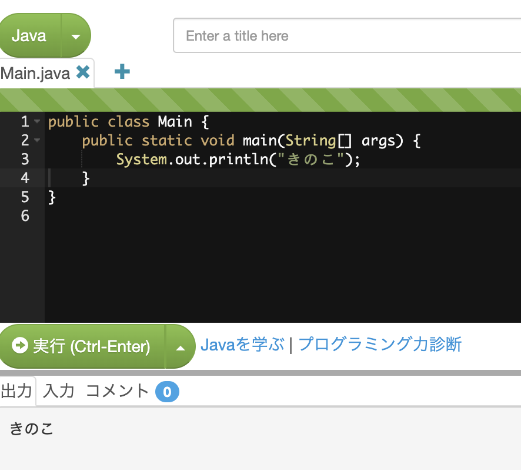

## 課題1
コンソールに自分の名前を表示するコードを書いてみましょう。

## 課題2
int型の変数ageを宣言し、宣言時に自分の年齢で初期化します。
コンソールにageの値を表示するコードを書き、自分の年齢が表示されることを確認しましょう。

## 課題3
課題2のコードの出力部分を、文字列と数値の連結を使って
私の年齢は26歳です
と表示されるように書き換えましょう。

## 課題4
int型の変数xを宣言し、宣言時に3で初期化します。
int型の変数yを宣言し、宣言時に5で初期化します。
コンソールにxとyの合計値を表示しましょう。(8と表示されます）

## 課題5
課題4のコードの出力部分を、文字列と数値の連結を使って
3と5の合計は8です
と表示されるように書き換えましょう。

## 課題6
int型の変数countを宣言し、0で初期化します。
コンソールにcountの値を表示しましょう。（0と表示されます）
続いて、以下の「〜増やす」の処理の部分を、全て違う書き方で書いてみてください。
countを2増やして、コンソールにcountの値を表示しましょう。（2と表示されます）
さらにcountを3増やして、コンソールにcountの値を表示しましょう。（5と表示されます）
さらにcountを1増やして、コンソールにcountの値を表示しましょう。（6と表示されます）

## 課題7
int型の変数numを宣言し、47で初期化します。
コンソールにnumを5で割ったあまりを表示しましょう。(2と表示されます）

## 課題8
int型の変数countを宣言し、10で初期化します。
コンソールにcountの値を表示しましょう。（10と表示されます）
続いて、以下の「〜減らす」の処理の部分を、全て違う書き方で書いてみてください。
countを2減らして、コンソールにcountの値を表示しましょう。（8と表示されます）
さらにcountを3減らして、コンソールにcountの値を表示しましょう。（5と表示されます）
さらにcountを1減らして、コンソールにcountの値を表示しましょう。（4と表示されます）

