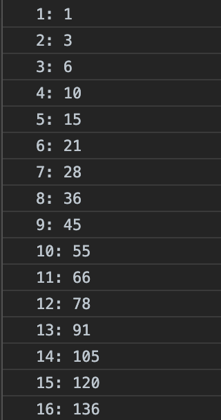

## 課題①
1 + 2 + 3 + 4 + ・・・と順に足していき、和がはじめて1000を超えるときの，足した数字とその和を求めましょう。
途中の和もコンソールに表示してください。
※ 回答は各問題の投稿にリプライする形で送ってください。



---

## 回答
```
import java.util.*;

public class Main {
public static void main(String[] args){
int sum,count;

        for(sum = 0,count = 1;sum <= 1000;count++){
            sum = sum + count;
           System.out.println(count + ":" + sum);
        }

System.out.println("和が初めて1000を超えるのは" + count + "を足したときで、その和は" + sum + "です");
}
}

1:1
2:3
3:6
4:10
5:15
6:21
7:28
8:36
9:45
10:55
11:66
12:78
13:91
14:105
15:120
16:136
17:153
18:171
19:190
20:210
21:231
22:253
23:276
24:300
25:325
26:351
27:378
28:406
29:435
30:465
31:496
32:528
33:561
34:595
35:630
36:666
37:703
38:741
39:780
40:820
41:861
42:903
43:946
44:990
45:1035
和が初めて1000を超えるのは46を足したときで、その和は1035です
```

---

## review

出力結果を確認してみてください。
`0`に`1`を足した時は`1`，`1`に`2`を足したときに`1+2=3`・・・と，正しい出力結果が得られているのがわかります。
つまり，最後の行
```
45:1035
```
は正しいと言えます。  
（これは`1+2+3+・・・+44+45=103`5ということです）  
ということは，和が初めて`1000`を超えるのは，`45`を足したときのはずですね。  
さて，最終的な答えの出力

>和が初めて1000を超えるのは46を足したときで、その和は1035です

これはどうでしょうか？正しい答えは，`46`ではなく`45`のはずですね。
最後の答えを出力した時点で`count`が`46`になってしまうのは，for文の`()`の中の式の評価順/実行順（`count`が`++`されるタイミング）が原因です。
for文は，初期化式（`sum=0, count=1`）の状態で`{}`の中を実行し始めます。  

for文の閉じカッコ`}`に行き着くと，頭に帰ってくるのですが，このとき、  

変化式部：`count++`  
評価式部：`sum <= 1000`の評価  
の順で実行されます。  

プログラムを細かく追っていきましょう。
1回目の`{処理}`実行の時点で，sumは1，countは1になり，その状態を出力しています。
```
1:1
```
の部分です。  
次，`}`に行き着いたので，for文の頭に戻ります。
`count`を`1`増やし，`sum<=1000`が`true`であることを確認した後，2回目のループに入ります。
中略，
```
44:990
```
を出力したところまで進めます。
このとき，`count`は`44`,`sum`は`990`ですね。
出力後，`}`に行き着くので，for文の頭に帰ります。
`count`を`45`にします。`sum<=1000`を評価して`true`なのでもう一回ループに入ります。
```
45:1035
```
が出力されます。`}`に行き着き，またfor文の頭に戻ります。
`count`が`46`になります。`sum<=1000`を評価すると`false`なのでループには入らず`}`の後ろに抜けます。
最後の答えが出力されます。
このような仕組みで，`46`が出力されてしまいます。
while文で書いたほうが，その順番が整理しやすいかもしれません。
上記のfor文の実行順（評価順）をしっかり理解した上で，while文で書いて，もう一度提出してください。  
**※ 注意：　最後に`count--`するのはNGです！**

---

## 再提出分
```
import java.util.*;

public class Main {
public static void main(String[] args){

      int sum = 0;
      int count = 0;
     
      while(sum <= 1000){
          count++;
           sum = sum + count;
           System.out.println(count +  ":" + sum);
      }
   
      System.out.println("和が初めて1000を超えるのは" + count + "を足したときで、その和は" + sum + "です");
   
    }
}

1:1
2:3
3:6
4:10
5:15
6:21
7:28
8:36
9:45
10:55
11:66
12:78
13:91
14:105
15:120
16:136
17:153
18:171
19:190
20:210
21:231
22:253
23:276
24:300
25:325
26:351
27:378
28:406
29:435
30:465
31:496
32:528
33:561
34:595
35:630
36:666
37:703
38:741
39:780
40:820
41:861
42:903
43:946
44:990
45:1035
和が初めて1000を超えるのは45を足したときで、その和は1035です
```

---

## 再レビュー

良いですね！
for文とwhile文の使い分けとしてよくあるのは，以下のような使い分け方です。
いつまでループするかわかっている場合はfor文。例えば，配列の頭から末尾までをなにかする，など。
いつ終わるかわからない場合はwhile文。例えば，ファイルの最終行に行き着いたら終了するような処理や，じゃんけんをして3回勝ったら終了，など。
とはいえ，最近のモダンな言語では，そもそもforやwhileをあまり使わない書き方（stream処理など）をすることも多くなってきました。